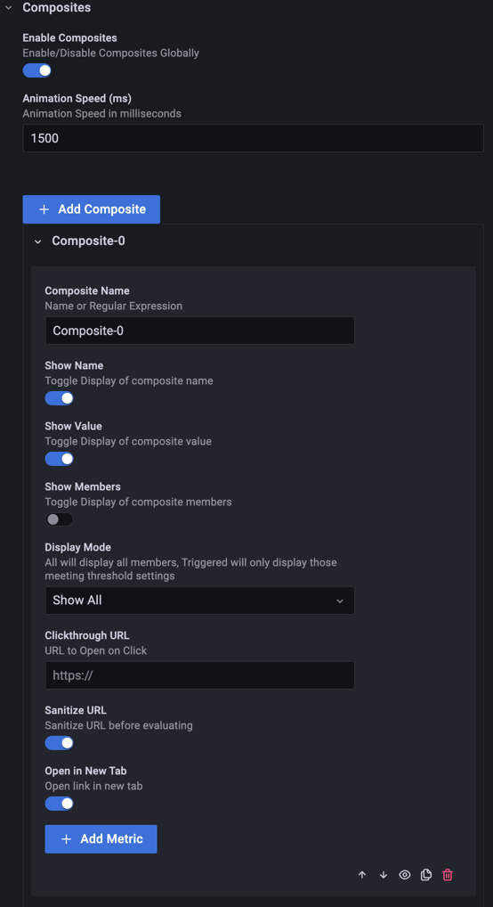
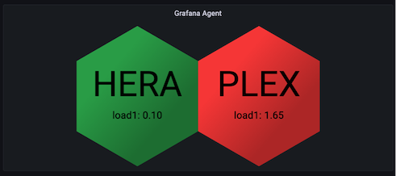
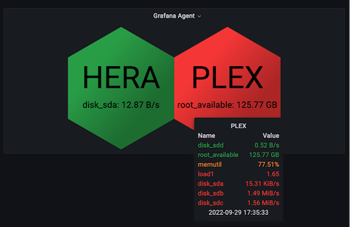
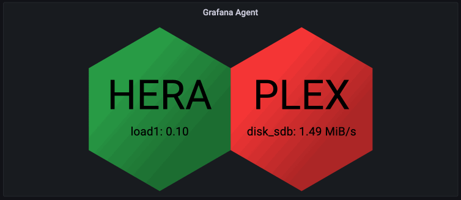
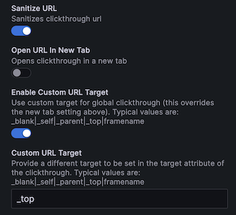
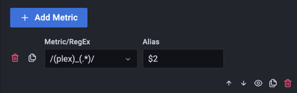

Composites combine multiple metrics into a single polygon that reflects the worst state of the metrics it contains. Use them as a roll-up view of a more complex system. When a composite holds several metrics, its polygon cycles through them.

| Option                    | Type   | Default | Description                                                            |
| ------------------------- | ------ | ------- | ---------------------------------------------------------------------- |
| Composite Global Aliasing | Toggle | `false` | Enable / Disable composite global aliasing                             |
| Composites                | Custom |         | Composites allow you to roll up multiple metrics into a single polygon |

**Composite Global Aliasing** applies the **Global Regex** from [Global options](./global.md#global-aliasing) to composite names as well as metric names.

Two rendered composites:

The tooltip when you hover over a composite lists its member metrics:

## Animation

When a composite has several metrics to display, the polygon cycles through each of them. This example shows two composites and their animation sequence:

Two settings at the top of the **Composites** editor apply to all composites:

- **Enable Composites**: Turns rendering of all composites on or off. Composites are enabled by default. Each composite also has its own eye icon to toggle it.
- **Animation Speed (ms)**: How long each step of the animation cycle lasts, in milliseconds. The default is `1500`. Values below `200` are raised to `200`.

## Composite settings

Click **Add Composite** to create a composite, then configure:

- **Composite Name**: The name to render. It accepts a regular expression and template variables. Capture groups let you simplify the displayed name with the metric **Alias**. When the name contains a multi-value template variable, the panel creates one composite for each selected value. Refer to [Examples](../examples.md#build-composites-from-a-template-variable).
- **Show Name**: Shows or hides the composite name on the polygon.
- **Show Value**: Shows or hides the value on the polygon.
- **Show Timestamp**: Shows the timestamp for each value. **Timestamp Format** and **Timestamp Y Offset** work like the matching [global timestamp options](./global.md#timestamps).
- **Show Members**: Shows the composite along with each of its member metrics as separate polygons. Typically you leave this off and display only the composite.
- **Display Mode**: Overrides the global display mode for this composite. **Show All** displays every metric, **Show Triggered** displays only the metrics with a triggered threshold.
- **Clickthrough URL**: The URL to open when you click the polygon. Regular expression capture groups and template variables are available to build the URL. Refer to [Clickthrough URLs](../clickthrough-urls.md#composite-metric-variables).
- **Sanitize URL**: Usually enabled, to prevent malicious data entry.
- **Open URL in New Tab**: Opens the URL in a new tab. Turn this off for drill-down dashboards.
- **Enable Custom URL Target**: Lets you set a custom value for the `target` attribute of the link. This option is only visible when **Open URL in New Tab** is off.
- **Custom URL Target**: The value for the `target` attribute. Typical values are `_blank`, `_self`, `_parent` and `_top`.

## Add metrics to a composite

Click **Add Metric** to append a metric to the composite.

- **Metric/RegEx**: The editor lists the metrics your queries return and also accepts a regular expression, which can include template variables. The panel expands template variables first, then applies the regular expression to filter which metrics the composite includes.
- **Alias**: When set, the panel displays this instead of the metric name. Capture groups from the metric name and template variables are available to build the new name.

## Bottom menu

The menu at the bottom right of each composite has these controls:

- **Move Up** and **Move Down**: Reorder the composite to group related ones.
- **Hide/Show Composite**: The eye icon turns the composite on or off.
- **Duplicate**: Copies the composite and appends it to the end of the list, with `Copy` added to its name.
- **Delete Composite**: Removes the composite.
