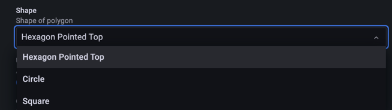
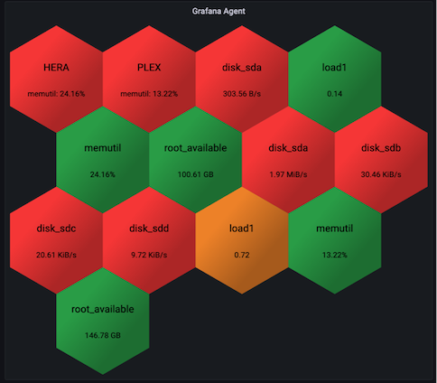
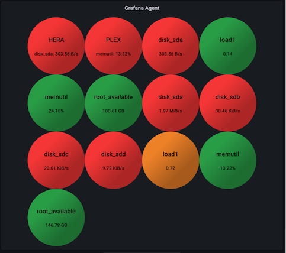
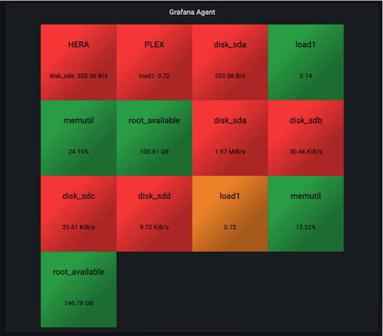
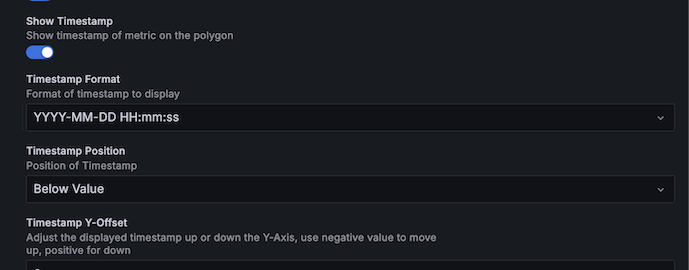
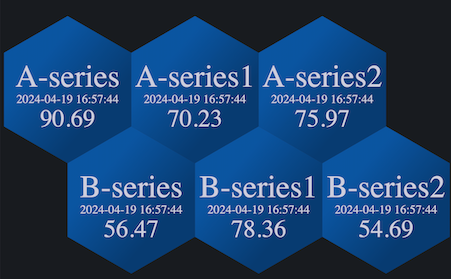
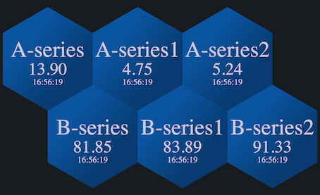
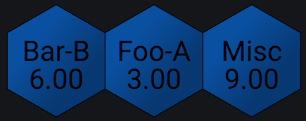
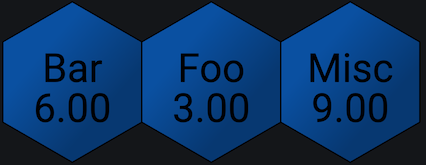

The **Global** category holds the settings that apply to every polygon unless an [override](./overrides.md) or [composite](./composites.md) replaces them. **Global Aliasing** sits in its own category directly after it.

## Global options

| Option                   | Type   | Default                 | Description                                                                                                                                                              |
| ------------------------ | ------ | ----------------------- | ------------------------------------------------------------------------------------------------------------------------------------------------------------------------ |
| Display Mode             | Select | `Show All`              | Show either all metrics/composites or only triggered                                                                                                                     |
| Non Triggered State Text | Text   | `OK`                    | Text to be displayed in polygon when there are no triggered thresholds and global display mode is set to triggered                                                       |
| Show Value               | Toggle | `true`                  | Show value on the polygon                                                                                                                                                |
| Show Timestamp           | Toggle | `false`                 | Show timestamp of metric on the polygon                                                                                                                                  |
| Timestamp Format         | Select | `YYYY-MM-DD HH:mm:ss`   | Format of timestamp to display                                                                                                                                           |
| Font Size                | Number | `12`                    | Default font size to use when Global Auto Scale Fonts is disabled                                                                                                        |
| Timestamp Position       | Select | `Below Value`           | Position of Timestamp                                                                                                                                                    |
| Timestamp Y-Offset       | Number | `0`                     | Adjust the displayed timestamp up or down the Y-Axis, use negative value to move up, positive for down                                                                   |
| Shape                    | Select | `Hexagon Pointed Top`   | Shape of polygon                                                                                                                                                         |
| Use Color Gradients      | Toggle | `true`                  | Applies gradient color effect to all polygons                                                                                                                            |
| Global Fill Color        | Color  | `rgba(10, 85, 161, 1)`  | Color to use when no overrides or thresholds apply to polygon                                                                                                            |
| Global Border Color      | Color  | `rgba(0, 0, 0, 0)`      | Color of polygon border                                                                                                                                                  |
| Unit                     | Unit   | `short`                 | Use this unit format when it is not specified in overrides or detected in data                                                                                           |
| Stat                     | Select | `Mean (avg)`            | Statistic to display                                                                                                                                                     |
| Decimals                 | Number | `2`                     | Display specified number of decimals                                                                                                                                     |
| Global Thresholds        | Custom |                         | Default thresholds to be applied to all metrics that do not have an override                                                                                             |
| Default Clickthrough     | Text   |                         | URL to use when none are defined by overrides or composites                                                                                                              |
| Sanitize URL             | Toggle | `true`                  | Sanitizes clickthrough url                                                                                                                                               |
| Open URL In New Tab      | Toggle | `true`                  | Opens clickthrough in a new tab                                                                                                                                          |
| Enable Custom URL Target | Toggle | `false`                 | Use custom target for global clickthrough (this overrides the new tab setting above). Typical values are: \_blank\|\_self\|\_parent\|\_top\|framename                     |
| Custom URL Target        | Text   |                         | Provide a different target to be set in the target attribute of the clickthrough. Typical values are: \_blank\|\_self\|\_parent\|\_top\|framename                       |

## Display mode

**Display Mode** controls which polygons the panel draws:

- **Show All** draws a polygon for every metric.
- **Show Triggered** draws only the polygons with a triggered threshold.

When the display mode is **Show Triggered** and nothing has triggered, the panel shows **Non Triggered State Text** in place of the polygons.

## Shapes

Polystat draws one of four shapes and sizes each one to make the best use of the panel:

- Hexagon Pointed Top
- Circle
- Square
- Rectangle (Brick)

**Hexagon Pointed Top**

**Circle**

**Square**

## Colors and value formatting

- **Use Color Gradients** applies a shaded color instead of a uniform fill.
- **Global Fill Color** is the color for polygons that no threshold or override applies to.
- **Global Border Color** sets the border color. The border width comes from **Border Size** under [Layout and sizing](./layout.md#sizing).
- **Unit**, **Stat** and **Decimals** set how the panel computes and formats each value. **Stat** offers the full set of statistics Grafana provides.
- **Global Thresholds** apply to every metric that doesn't have a matching override. Refer to [Thresholds](../thresholds.md) for how the panel evaluates them.
- **Default Clickthrough** and the URL options after it apply to every polygon that doesn't get a clickthrough URL from an override or composite. Refer to [Clickthrough URLs](../clickthrough-urls.md).

## Timestamps

Turn on **Show Timestamp** to display the time of the metric on each polygon.

- **Timestamp Format** offers common formats and also accepts a custom format.
- **Timestamp Position** places the timestamp above or below the value. If the value isn't displayed, the timestamp takes the place where the value normally renders.
- **Timestamp Y-Offset** moves the timestamp to fine-tune placement. Positive values move it down, negative values move it up.
- **Font Size** sets the timestamp font size. It appears only when **Auto Scale Fonts** under [Text](./text.md) is off.

## Global aliasing

| Option       | Type | Default | Description                                                                                                                                                                                  |
| ------------ | ---- | ------- | -------------------------------------------------------------------------------------------------------------------------------------------------------------------------------------------- |
| Global Regex | Text |         | The values in the specified column are filtered and displayed according to this regular expression. Ex: String: Url\|broadcom.com\|mirror\|location-1 regex: /Url&#92;\|(.\*?)&#92;\|/ Output: broadcom.com |

**Global Regex** picks a portion of each matching metric name to display instead of the full name. The panel joins the capture groups with a space. Names that don't match keep their full name.

For example, three queries return these series:

- `Foo-A`, values 1, 2, 3
- `Bar-B`, values 4, 5, 6
- `Misc`, values 7, 8, 9

With the regular expression `/(Foo|Bar)/`, the polygons display `Foo`, `Bar` and `Misc`:

