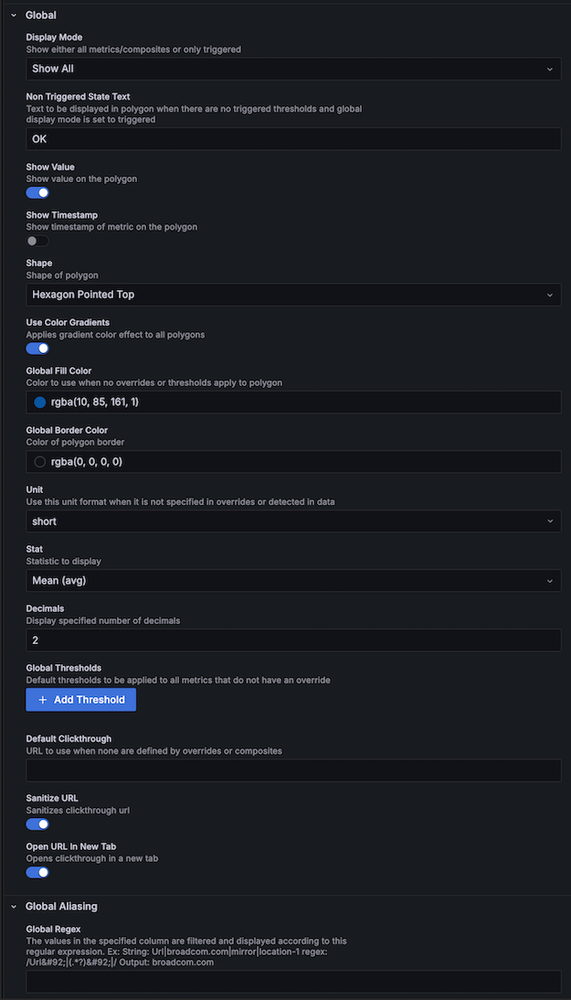

Polystat exposes a large number of options in the panel editor. Use the search box at the top of the options pane to find one by name. Each page in this section covers one or two of the panel editor categories:

| Category                   | Page                                    |
| -------------------------- | --------------------------------------- |
| Layout and Sizing          | [Layout and sizing](./layout.md)        |
| Text                       | [Text](./text.md)                       |
| Sorting                    | [Sorting](./sorting.md)                 |
| Tooltips                   | [Tooltips](./tooltips.md)               |
| Global and Global Aliasing | [Global options](./global.md)           |
| Overrides                  | [Overrides](./overrides.md)             |
| Composites                 | [Composites](./composites.md)           |

## Standard field options

Polystat turns off most of Grafana's standard field options because it provides its own equivalents under **Global** and **Overrides**. The only standard option it keeps is:

- Value mappings

Use the **Unit**, **Decimals** and **Global Thresholds** options under [Global options](./global.md) instead of the standard ones.

## Value mappings

Value mappings are a built-in Grafana option and behave as documented in [Configure value mappings](https://grafana.com/docs/grafana/latest/panels-visualizations/configure-value-mappings/). When a mapping matches, Polystat displays the mapped text in place of the formatted value.

Color assignments on value mappings are ignored, and only threshold colors are applied.
