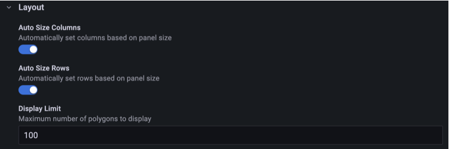
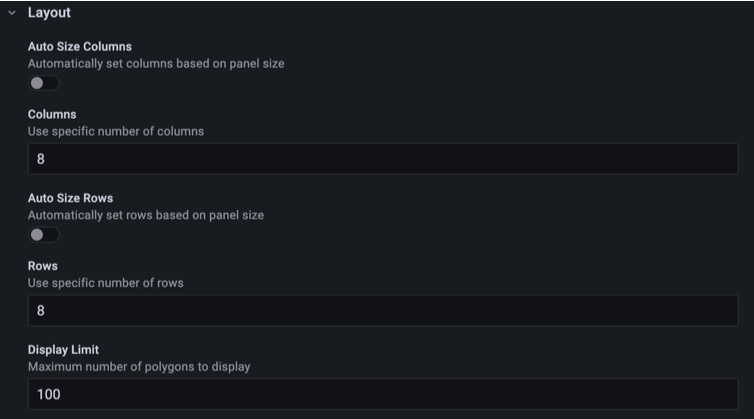
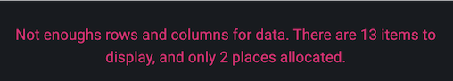
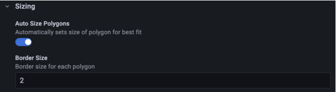
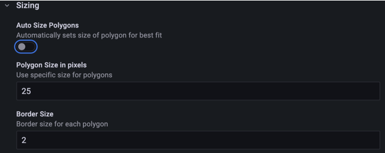

By default Polystat sizes and arranges the polygons with a best-fit calculation based on the size of the panel. The options in the **Layout** and **Sizing** categories let you take manual control.

## Layout

| Option            | Type   | Default | Description                                              |
| ----------------- | ------ | ------- | -------------------------------------------------------- |
| Auto Size Columns | Toggle | `true`  | Automatically set columns based on panel size            |
| Columns           | Number | `8`     | Use specific number of columns                           |
| Auto Size Rows    | Toggle | `true`  | Automatically set rows based on panel size               |
| Rows              | Number | `8`     | Use specific number of rows                              |
| Display Limit     | Number | `100`   | Maximum number of polygons to display (0 for unlimited)  |

**Columns** and **Rows** appear when you turn off the matching auto-size toggle, and set the maximum number of columns or rows to create. If you set both, the panel displays at most `rows * columns` polygons. With a manual layout, the panel centers the polygons based on how many it actually renders.

If there aren't enough columns and rows to display all of the data, the panel shows a warning. Refer to [Troubleshooting](../troubleshooting.md#not-enough-rows-and-columns-for-data) for how to resolve it.

**Display Limit** caps how many polygons the panel draws. Set it to `0` for no limit.

## Sizing

| Option                 | Type   | Default | Description                                      |
| ---------------------- | ------ | ------- | ------------------------------------------------ |
| Auto Size Polygons     | Toggle | `true`  | Automatically sets size of polygon for best fit  |
| Polygon Size in pixels | Text   | `25`    | Use specific size for polygons                   |
| Border Size            | Number | `2`     | Border size for each polygon                     |

Turn off **Auto Size Polygons** to set a size manually. **Polygon Size in pixels** accepts a number or a dashboard template variable that resolves to a number, so you can let dashboard viewers pick the size. If the value is negative or doesn't resolve to a number, the panel falls back to 50 pixels.

**Border Size** sets the border width of each polygon in pixels. Set the border color with **Global Border Color** under [Global options](./global.md).

