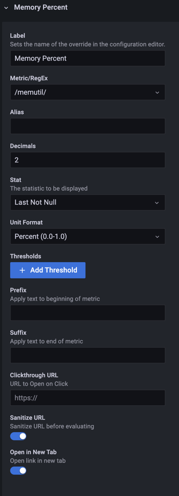
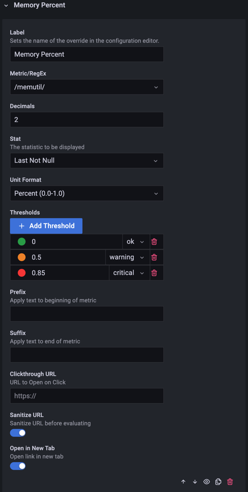
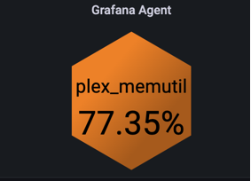

Use overrides to apply additional rendering options to specific metrics, including custom thresholds and clickthrough URLs. Each override matches metrics by name or regular expression and replaces the matching global settings for those metrics.

| Option    | Type   | Default | Description                    |
| --------- | ------ | ------- | ------------------------------ |
| Overrides | Custom |         | Overrides for multiple metrics |

This override sets the unit for metrics that match a regular expression:

This is the same override with thresholds added:

The rendered result with the thresholds applied:

## Override settings

- **Label**: A label that makes the override easier to find in the list. The panel doesn't render it on the polygon.
- **Metric/RegEx**: The metric this override applies to. The editor suggests metric names from your queries, and you can enter a regular expression to match several metrics. Template variables in the pattern are expanded first.
- **Decimals**: The maximum number of decimals to display. Leave it empty to show all decimals.
- **Stat**: The statistic to display for matching metrics, in place of the global **Stat**. The full set of statistics Grafana provides is available.
- **Unit Format**: The unit applied to the displayed value. The formatter typically adds a suffix for the unit, such as `B/sec`, or a symbol for temperatures and percentages.
- **Show Timestamp**: Displays the timestamp on matching polygons. **Timestamp Format** and **Timestamp Y Offset** work like the matching [global timestamp options](./global.md#timestamps).
- **Thresholds**: A set of thresholds for matching metrics, in place of **Global Thresholds**. Refer to [Thresholds](../thresholds.md) for how the panel evaluates them.
- **Prefix**: Text added to the beginning of the rendered value.
- **Suffix**: Text added to the end of the rendered value, after any unit text.
- **Clickthrough URL**: The URL to open when you click a matching polygon. The URL options after it work like the global ones. Refer to [Clickthrough URLs](../clickthrough-urls.md), including how to use capture groups from **Metric/RegEx** in the URL.

## Evaluation order

Each metric uses the first enabled override whose **Metric/RegEx** matches its name. Later overrides that also match don't apply. Metrics without a matching override use the global settings.

## Bottom menu

The menu at the bottom right of each override has these controls:

- **Move Up** and **Move Down**: Reorder the override to change its evaluation priority or to group similar overrides together.
- **Hide/Show Override**: The eye icon turns the override on or off.
- **Duplicate**: Copies the override and appends it to the end of the list, with `Copy` added to its name.
- **Delete Override**: Removes the override.
