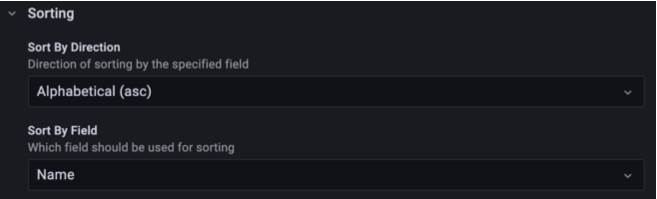
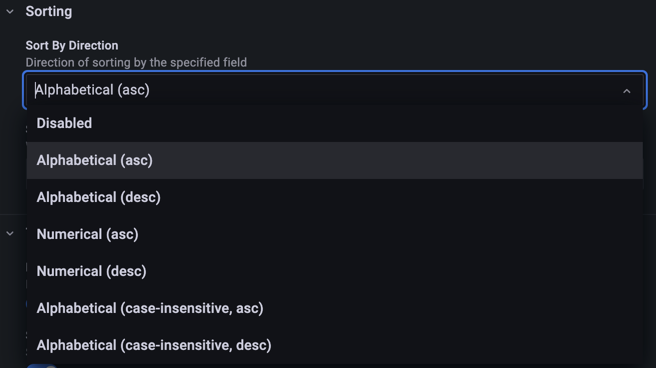
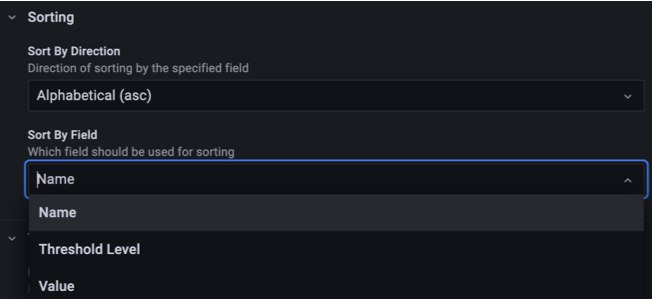

The **Sorting** category sets the order, from left to right, in which Polystat draws the polygons. The panel sorts after it applies the global display mode, overrides and composites.

## Sorting options

| Option            | Type   | Default              | Description                                  |
| ----------------- | ------ | -------------------- | -------------------------------------------- |
| Sort By Direction | Select | `Alphabetical (asc)` | Direction of sorting by the specified field  |
| Sort By Field     | Select | `Name`               | Which field should be used for sorting       |

## Sort directions

| Direction                              | Behavior                                                                        |
| -------------------------------------- | ------------------------------------------------------------------------------- |
| Disabled                               | No sorting. Polygons keep the order of the query results.                       |
| Alphabetical (asc)                     | Case-sensitive alphabetical, ascending.                                         |
| Alphabetical (desc)                    | Case-sensitive alphabetical, descending.                                        |
| Numerical (asc)                        | Numerical, ascending. For text, sorts by the first number found in the text.    |
| Numerical (desc)                       | Numerical, descending. For text, sorts by the first number found in the text.   |
| Alphabetical (case-insensitive, asc)   | Case-insensitive alphabetical, ascending.                                       |
| Alphabetical (case-insensitive, desc)  | Case-insensitive alphabetical, descending.                                      |
| Natural sort (asc)                     | Natural order, so `host2` comes before `host10`, ascending.                     |
| Natural sort (desc)                    | Natural order, descending.                                                      |

## Sort fields

| Field           | Sorts by                                  |
| --------------- | ----------------------------------------- |
| Name            | The polygon name, after all aliasing.     |
| Threshold Level | The threshold state, lowest to highest.   |
| Value           | The raw value.                            |

Tooltips have their own primary and secondary sort settings. Refer to [Tooltips](./tooltips.md#tooltip-sorting).
