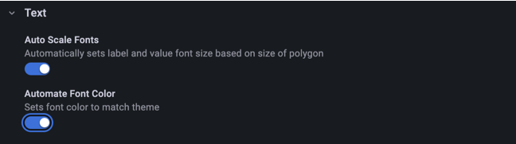
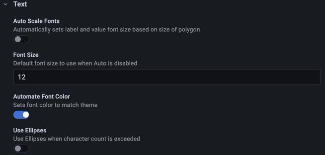
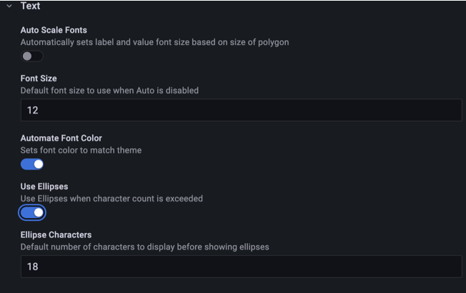
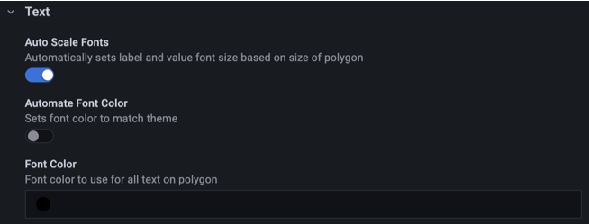
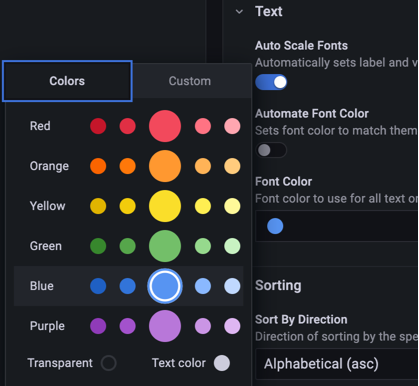

Polystat tries to display as much text as possible with the largest font possible across all polygons. When the complete text can't fit, the panel hides it and the tooltip remains the way to read the polygon. The options in the **Text** category let you set the font family, size and color manually.

## Text options

| Option                    | Type   | Default   | Description                                                            |
| ------------------------- | ------ | --------- | ---------------------------------------------------------------------- |
| Font Family               | Select | `Inter`   | Font used for rendered text                                            |
| Auto Scale Fonts          | Toggle | `true`    | Automatically sets label and value font size based on size of polygon  |
| Label Font Size           | Number | `12`      | Label font size                                                        |
| Value Font Size           | Number | `14`      | Value font size                                                        |
| Composite Value Font Size | Number | `14`      | Composite Value font size                                              |
| Automate Font Color       | Toggle | `true`    | Sets font color to match theme                                         |
| Font Color                | Color  | `#000000` | Font color to use for all text on polygon                              |
| Use Ellipses              | Toggle | `false`   | Use Ellipses when character count is exceeded                          |
| Ellipse Characters        | Number | `18`      | Default number of characters to display before showing ellipses        |

## Font family

**Font Family** defaults to `Inter`. On Grafana versions earlier than 9.4 the default is `Roboto`, and the list offers `Roboto` in place of `Inter`. When you upgrade, the panel migration converts `Roboto` to `Inter`.

## Font size

With **Auto Scale Fonts** on, the panel sets the label and value font sizes from the size of each polygon.

Turn it off to set **Label Font Size**, **Value Font Size** and **Composite Value Font Size** yourself. The **Font Size** option for timestamps under [Global options](./global.md#timestamps) also appears when automatic scaling is off.

With automatic scaling off, you can also turn on **Use Ellipses** to truncate labels longer than **Ellipse Characters**.

## Font color

**Automate Font Color** picks a font color from the current theme, which may not suit every fill color. Turn it off to choose a color with **Font Color**.

