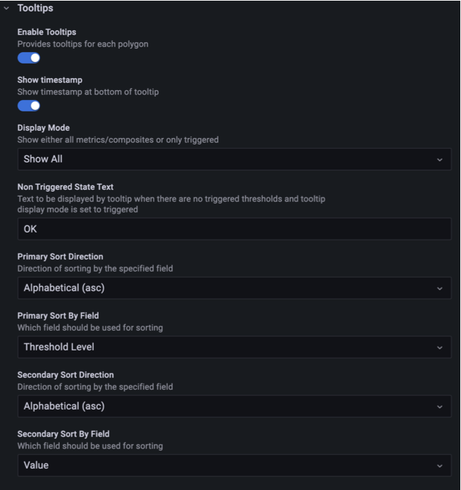
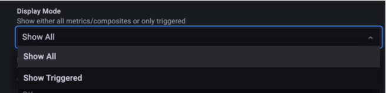
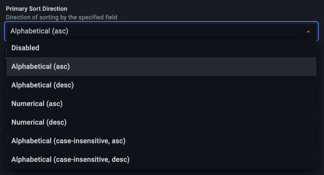
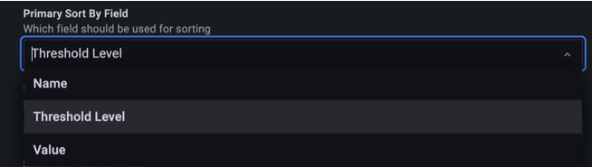

Hovering over a polygon opens a tooltip with the polygon's metrics. For a composite, the tooltip lists every member metric. The options in the **Tooltips** category control what the tooltip shows and in which order.

## Tooltip options

| Option                   | Type   | Default              | Description                                                                                                         |
| ------------------------ | ------ | -------------------- | ------------------------------------------------------------------------------------------------------------------- |
| Enable Tooltips          | Toggle | `true`               | Provides tooltips for each polygon                                                                                  |
| Font Family              | Select | `Inter`              | Font used for tooltip text                                                                                          |
| Show Timestamp           | Toggle | `true`               | Show timestamp at bottom of tooltip                                                                                 |
| Show Value               | Toggle | `true`               | Show values in tooltip                                                                                              |
| Show Column Headers      | Toggle | `true`               | Show Column headers on tooltip                                                                                      |
| Display Mode             | Select | `Show All`           | Show either all metrics/composites or only triggered                                                                |
| Non Triggered State Text | Text   | `OK`                 | Text to be displayed by tooltip when there are no triggered thresholds and tooltip display mode is set to triggered |
| Primary Sort Direction   | Select | `Alphabetical (asc)` | Direction of sorting by the specified field                                                                         |
| Primary Sort By Field    | Select | `Threshold Level`    | Which field should be used for sorting                                                                              |
| Secondary Sort Direction | Select | `Alphabetical (asc)` | Direction of sorting by the specified field                                                                         |
| Secondary Sort By Field  | Select | `Value`              | Which field should be used for sorting                                                                              |

As with the text options, **Font Family** defaults to `Roboto` on Grafana versions earlier than 9.4.

## Display mode

**Display Mode** shows either every metric in the tooltip or only the metrics that have triggered a threshold. **Show Triggered** is useful when a composite rolls up many metrics and you only care about the ones in a warning or critical state.

When the display mode is **Show Triggered** and no threshold has triggered, the tooltip shows **Non Triggered State Text** instead of the metric value. Leave it blank to show the value.

## Tooltip sorting

When a composite shows several metrics, the tooltip sort options help you put the important data at the top. You set a primary field and direction, plus a secondary field and direction that the panel applies after the primary sort. Set a direction to **Disabled** to turn that level of sorting off.

The directions and fields are the same as for polygon sorting. Refer to [Sorting](./sorting.md) for the full list.

